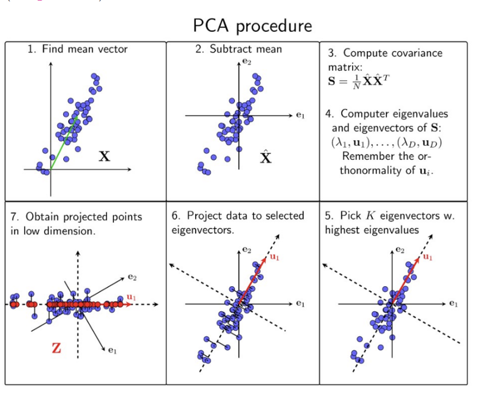
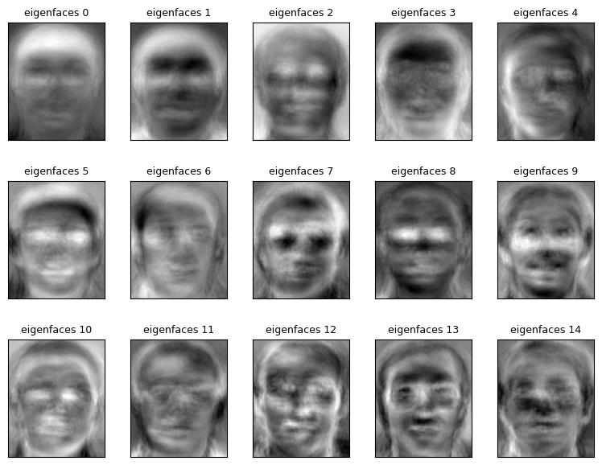
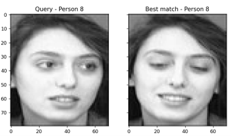
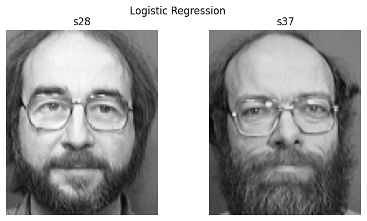

# Face Recognition in the Real World

Facial recognition is a method of identifying or verifying an individual's identity using their face. Facial recognition systems can be applied in various scenarios such as photos, videos, or real-time surveillance.

## PCA in Face Recognition

PCA is a dimensionality reduction method commonly used to reduce the dimensionality of large datasets. It transforms a large set of variables into a smaller one that preserves most of the original information.

In face recognition, PCA involves converting each image into a vector and forming a matrix for analysis.

Face recognition faces challenges in real-time processing due to the high dimensionality of raw face images. To mitigate this, dimensionality reduction or feature extraction techniques such as PCA are employed. PCA transforms the face space into a lower-dimensional feature space while retaining essential information.

 

## Steps in PCA-based Face Recognition

In KPCA, a Kernel matrix is formed, followed by the selection of the kernel function. The subsequent steps are similar to PCA.

 

## Output

### Eigenfaces

**First 15 eigenfaces out of 50 principal components were chosen.**

### Recognized and Unrecognized Faces

<table>
  <tr>
    <td>
       
      <b>Recognized Face</b>
    </td>
    <td>
       
      <b>Unrecognized Face</b>
    </td>
  </tr>
</table>
