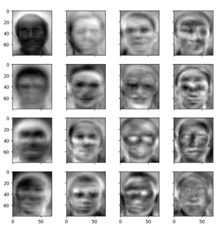
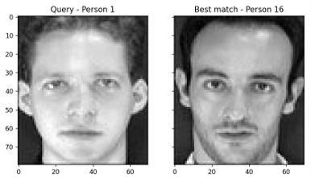

# Face Recognition with PCA

Facial recognition is a method of identifying or verifying an individual's identity using their face. Facial recognition systems can be applied in various scenarios such as photos, videos, or real-time surveillance.

## Objective

This project aims to conduct a comparative study on Face Recognition using PCA (Principal Component Analysis), 2D-PCA, and KPCA (Kernel Principal Component Analysis).

## PCA in Face Recognition

PCA is a dimensionality reduction method commonly used to reduce the dimensionality of large datasets. It transforms a large set of variables into a smaller one that preserves most of the original information.

In face recognition, PCA involves converting each image into a vector and forming a matrix for analysis.

Face recognition faces challenges in real-time processing due to the high dimensionality of raw face images. To mitigate this, dimensionality reduction or feature extraction techniques such as PCA are employed. PCA transforms the face space into a lower-dimensional feature space while retaining essential information.

## Steps in PCA-based Face Recognition

     1. Format the Image Matrix
     2. Compute the Mean Vector and Mean-Subtracted Image Matrix
     3. Calculate Eigenvectors and Eigenvalues from the Covariance Matrix
     4. Select Eigenfaces
     5. Compute the Weight Matrix
     6. Recognize the Face

In KPCA, a Kernel matrix is formed, followed by the selection of the kernel function. The subsequent steps are similar to PCA.

## Output

### Eigenfaces

**First 16 eigenfaces when 40 principal components were chosen.**

### Recognized and Unrecognized Faces

<table>
  <tr>
    <td>
       
      <b>Recognized Face</b>
    </td>
    <td>
       
      <b>Unrecognized Face</b>
    </td>
  </tr>
</table>
